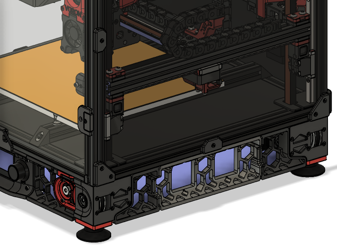

<B>Voron 2.4 Side Skirt mods for fanless and/or 40mm Fan support.</B>

These side middle skirts are designed to either go fanless or allow use of a 40mm fan instead of the default 60mm.

MCU Board cooling may be impacted using 40mm fans instead of 60mm fans. I don't have 60mm fans and plan on using 40x20mm fans left over from my old V2.2 toolheads (replaced by Afterburner toolheads). 

Fanless middle side skirt is similar to the <a href="https://github.com/VoronDesign/VoronUsers/tree/master/printer_mods/xbst_/V2.4_Fanless_Middle_Skirt">V2.4_Fanless_Middle_Skirt</a> by <a href="https://github.com/VoronDesign/VoronUsers/tree/master/printer_mods/xbst_">xbst_</a>, but has end profiles matching the side_a & side_b skirts.

40mm fan support middle side skirt

Mix and match the side skirt mods on either side.  Middle skirts should fit all Voron 2.4 sizes (250, 300, 350).

Side Skirt - Fanless

Side Skirt - 40mm Fan Support

